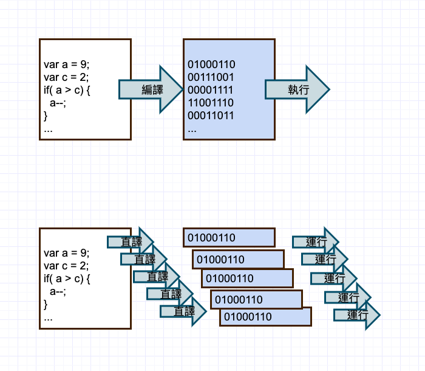
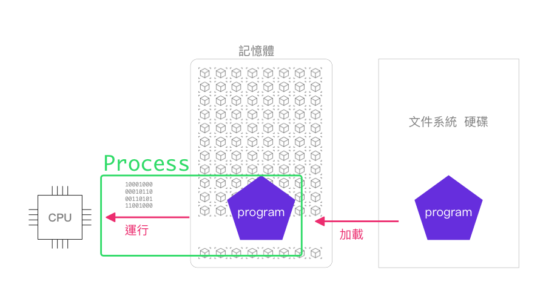
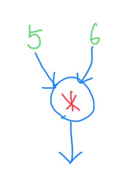
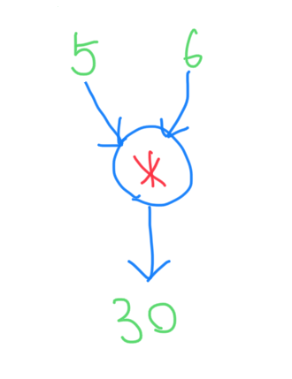

20220405

---

JavaScript 本質課

---

# 表達式與值

JS 編程原點

---

# 編程

## Program

---

我們平常寫的程式就是 Program

---

從電腦開機開始

---

開機 > 把主機板上的存儲的開機程式讀到記憶體中 > 

開機程式將[操作系統程式-內核 Kernel] 讀到記憶體中 >  

初始化 Process id 0 id 1 … > 
啟動系統服務：網路、防火牆、文件系統 > 

掛起一個等待

使用者登入後 > 載入用戶態模組 > 運行 shell  就可以跟 OS 對話了

---

上面的步驟中都有一個共同點 
就是把 Program 讀到記憶體中

---

我們得到一個結論

---

 Program 要被載入到記憶體才能運行


---

# Process 

進程 / 行程

---

想想看我們平常是怎麼運行一個程序的

---
兩種方式可以運行

1. 對著軟體直接點兩下開啟一個應用

2. 瀏覽器載入 JS 之後有一個「不知道什麼東西」把我的 JS 代碼變成 cpu 可以執行的機器碼(0101)

---

這兩種方式分別是

編譯、直譯（解釋）

---

編譯的意思就是 program 被變成一個二進制檔案
你可以直接點兩下執行這包二進制的程式碼

---

直譯(解釋) 意思就是你寫的高級語言代碼
例如 JS 透過一個直譯器（runtime）
逐行解釋給 cpu 運算


---



---



---


讓我們回到瀏覽器裡面

---

你寫的所有 JavaScript 
就是被 Chrome Process 讀到記憶體中
並且透過 V8 直譯(解釋)成了機器碼 010101 以後
再讓 cpu 進行計算的

---

JS 在記憶中的位置如下

---


---

一開始所有的 JS 會存被放在「靜態區」
v8 按照執行順序會將代碼移動到相應的其他區域

---

今天你們第一個要認識的區域就是 
Globle Object

---

# 值

---

看範例

---

```javascript
var a = 1
var b = a
b = 2
請問 a 的值？  
```

---

```javascript
var a = {name: 'a'}
var b = a
b = {name: 'b'}
請問現在 a.name 的值？ 
```

---

```javascript
var a = {name: 'a'}
var b = a
b.name = 'b'
請問現在 a.name 的值？ 
```

---

```javascript
var a = {name: 'a'}
var b = a
b = null
請問 a 的值？ 
```

---

# 區分傳值傳址
只有不懂記憶體佈局圖的人才需要這樣分

---

深拷貝 淺拷貝

---

```javascript
var a = 1
var b = a
b = 2 //這個時候改變 b 的值
```
a 完全不受 b 的影響那麼我們就說這是一個深拷貝

---

對於基礎值類型來說，賦值就是深拷貝

對於引用類型（oblect）來說
才要區分淺拷貝和深拷貝

---

這是一個淺拷貝的例子
```javascript
var a = {name: 'frank'}
var b = a
b.name = 'b'
a.name === 'b' // true
```

---

因為我們對 b 操作後 a 也變了
這就是淺拷貝

---

# 說明
上面對記憶體的認識對你的整個前端生涯有重要影響
少部分同學現在聽不懂沒關係
等你寫 JS一個月以上，就會發現本課的深意

如果不提前講，你對 JS 的理解或多或少會產生一些偏差
所以請耐心地重複複習上面講的所有知識

---
  ###### 我是分隔線
---

# 測試題

---

### 以下說法哪幾個是正確的 ? 

1. 一般來說要把 program 加載到記憶體才能運行
2. 雙擊 Chrome 會啟動一個 Chrome process，這個 process 會啟動其他子 process
3. 子 process 不是 process ( 這是錯的 )
4. 線程不是 process，線程是一種比 process 更輕量的概念
5. JS 只能單線程執行

---

這段代碼中
```javascript
var person = {name:'john'}
var person2 = person
person2.name = 'bob'
console.log(person.name) // 'bob'
```
為什麼 person.name 會改變？

請用畫圖的方式畫出來

---

有工作經驗的同學
能試著寫出一個身拷貝 deepClone 函數嗎？

```javascript
var a = { name: 'Mary' }
var b = deepClone(a) // deepClone()
b.name = 'xxx'
a.name === 'Mary' // true
```

---

  ###### 我是分隔線

---

# 什麼是計算

---

簡單的說
計算就是一個求值的過程

---

數字本身就是表達式
叫做 [Numerical literals](https://developer.mozilla.org/zh-TW/docs/Web/JavaScript/Guide/Grammar_and_types#%E6%95%B4%E6%95%B8%E5%AD%97%E9%9D%A2%E5%80%BC_numerical_literals)

```js
1
> 1
```

---

你知道答案是多少嗎

```js
5 * 6
> ?
```

---

```js
5 + 5 * 6
> ?
```

---

等同於
```js
((5) + (5 * 6))
> 35
```

---

我們可以這樣說
```js

(5 * 6) evaluate (30)

((5) + (30)) evaluate (35)

```
evaluate => 求得

---

在 js 的語法中
括號包起來的就是一句表達式

```js
( (5) + (6) * (9 + 3) )
> 77
```

---

我們也能將表達式求得的「值」
賦值給一個變數

```js
var a = (1 + 9);
var b = (20);

(a + b)
> 30
```

---

寫程式不只有數字的運算

```js
(5) + (6) * (9 + 3)
> 77
```

---

一句求值表達式
```js

( 2 * 3 )

```
是代表什麼意義呢？

---



---

這就是一個函數 function 的意思

---

輸入 -> 計算 -> 輸出



---

來定義一個最簡單的 function

---

```js
(x => x + 1)
```

---

這個 function 表示了
可以接受一個 參數 x 
並且做了將 x + 1 的計算
然後輸出計算後的結果

---

讓我們試一下

```js
(x => x + 1)(3)
> 4
```

---

把參數 3 傳給函數並執行就叫做
Function call

```js

(x => x + 1)(3)

> 4

```
---

意思等於我們平常這樣的寫法
```js

var add1 = (x => x + 1)

(add1)(3)

> 4

```

---

或者去括號的寫法

```js

var add1 = x => x + 1

add1(3)

> 4

```
---

以及最常看到的 function 宣告的方式

```js

function add1(x) { return x + 1 } 

add1(3)

> 4

```

---

稍微複雜一點
是否還看得懂呢？

```js

(1)

(x => x + 1)(3)

(x => x * x)((x => x + 1)(3))

(x => x + 10)((x => x * x)((x => x + 1)(3)))

```

---

請看 play.js 練習

---

## 結束
今天講了 JS 中
「值」在記憶體中佈局內的賦值操作實際上的意義
「函數表達式」的操作

---

在學習更後面的東西時
所有的知識都可以回朔到這兩個基礎原點

### 1 記憶體佈局

### 2 基礎函數操作

---

感謝各位參與

---

謝謝


